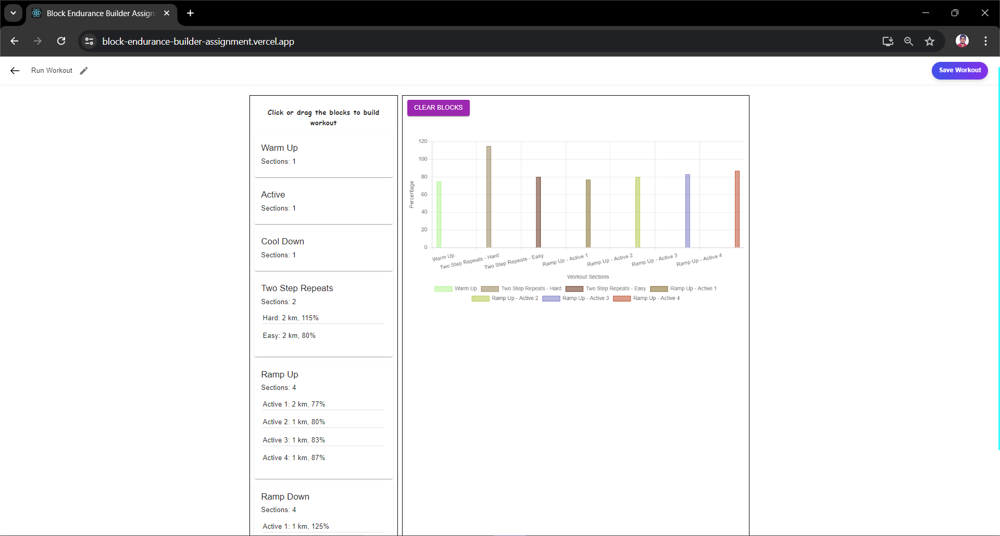

# Block Endurance Builder Assignment

Block Endurance Builder Assignment is a web application designed to facilitate workout planning and visualization. Users can dynamically edit workout inputs, rearrange blocks using drag-and-drop functionality, and visualize their workout structure through interactive bar graphs.

## Features:

- Edit Run Workout input text present in navbar: Users can easily modify workout details directly from the navigation bar.
- Drag and drop workout blocks: Intuitive drag-and-drop interface for organizing workout blocks.
- Drop and get bar graph representation: Instant visualization of workout structure using responsive bar graphs.
- Add multiple blocks inside bar graph: Ability to add multiple workout blocks within the bar graph for detailed planning.
- Click on clear blocks button and bar graph items will be gone and the empty text will show: Clear all workout blocks from the graph with a single click, providing a clean slate for new plans.

## Getting Started

**First, clone the repository:**

```bash
git clone https://github.com/Hashal890/block-endurance-builder-assignment.git
cd block-endurance-builder-assignment
```

**Then, install the dependencies:**

```bash
npm install
# or
yarn install
# or
pnpm install
# or
bun install
```

**Then, run the development server:**

```bash
npm run start
# or
yarn start
# or
pnpm start
# or
bun start
```

## Technologies used

- [JavaScript](https://developer.mozilla.org/en-US/docs/Web/JavaScript)
- [React.js](https://react.dev/learn/installation)
- [Chart.js](https://www.npmjs.com/package/chart.js)
- [React Chart.js 2](https://www.npmjs.com/package/react-chartjs-2)
- [Re Resizable](https://www.npmjs.com/package/re-resizable)
- [Hello Pangea Dnd](https://www.npmjs.com/package/@hello-pangea/dnd)
- [Material UI](https://mui.com/material-ui/getting-started/installation/)
- [React Icons](https://react-icons.github.io/react-icons/)
- [CSS](https://developer.mozilla.org/en-US/docs/Web/CSS)
- [HTML](https://developer.mozilla.org/en-US/docs/Web/HTML)
- [Vercel](https://vercel.com/)

## Project Demonstration

**Image Preview:**



**Video Overview:**

[View Video](https://drive.google.com/file/d/1s1G0SWHA05nrms6IzFCf0UELJkl4RoBk/view?usp=sharing)
